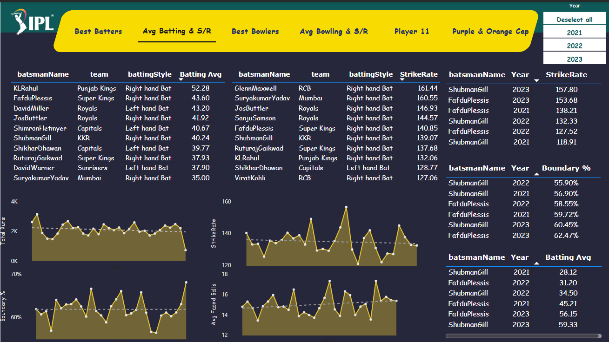

# T20-world-cup-cricket-data-analytics-Cricket-Analysis-

•	Created a Power BI report to identify top 11 players for a T20 cricket team by scraping data from espncricinfo with a webscrapper website tool, cleaning and trasforming the data with pandas, and evaluating various player performance metrics.

•	Used the resulting Power BI dashbaord to select players for various categories (openers, middle order/anchors, finishers, all-rounders, specialist fast bowlers) and ultimately choose the top 11 players to play in the match.

•	Selected team using the Power BI dashboard has 90% of chances to win the game.

## Datasets:

Dim_Players :

Dim_Match_Summary :

Fact_Bating_Summary :

Fact_Bowling_Summary :

## SQL Queries (Primary Analysis) : 

1. Top 10 batsmen based on past 3 years total runs scored.

2. Top 10 batsmen based on past 3 years batting average. (min 60 balls faced in
each season)

3. Top 10 batsmen based on past 3 years strike rate (min 60 balls faced in each
season)

4. Top 10 bowlers based on past 3 years total wickets taken.

5. Top 10 bowlers based on past 3 years bowling average. (min 60 balls bowled in
each season)

6. Top 10 bowlers based on past 3 years economy rate. (min 60 balls bowled in
each season)

7. Top 5 batsmen based on past 3 years boundary % (fours and sixes).

8. Top 5 bowlers based on past 3 years dot ball %.

9. Top 4 teams based on past 3 years winning %.

10. Top 2 teams with the highest number of wins achieved by chasing targets over
the past 3 years.

## Final Dashboard Look:

Best Batters:

AVG Batting vs S/R :

Best Bowlers :

AVG Bowling vs S/R :

Player 11 :

Purple & Orange Cap : 

That's all about This Project

"ThankYou Very Much "

## 👤 Author

**[Nidhi Kachhi]**  
📧 Email:[haldkarnidhi@gmail.com](mailto:haldkarnidhi@gmail.com)   
🌐 GitHub: [github.com/Np2002](https://github.com/Np2002)
📎 LinkedIn: [linkedin.com/in/nidhi-kachhi](https://www.linkedin.com/in/nidhi-kachhi/)